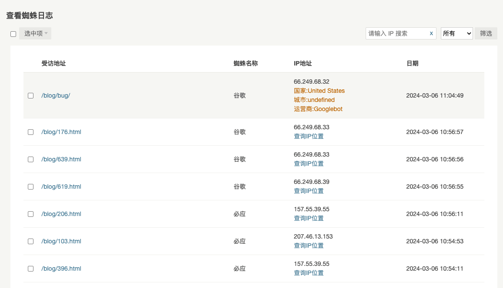

# Spider Tracker

Typecho的蜘蛛访问记录插件. Spider Tracker plugin for Typecho

## 使用方法

下载仓库代码，将文件夹命名为`SpiderTracker`上传到Typecho的`usr/plugins`，后台启用插件即可。

## 反馈

如果有问题可以在该github仓库直接提issue或者在我博客文章下留言即可：[https://dongge.org/blog/1261.html](https://dongge.org/blog/1261.html)

## 预览

### 历史背景

本插件原是`Shion`创建的`Robots`、之后`YoviSun`升级为`RobotsPlus`，再到后面的`RYan`升级`RobotsPlusPlus `，无限循环，却没有一个版本控制的概念，搜了github找不到一个库，散落在互联网的某个角落，所以创建该库并重新整理规划开发。

### 优化功能

* 适配Typecho1.2.1版本
* 蜘蛛列表由输入方式修改为点选方式，更加简单
* 修改ip查询功能，增加设置项
* ip查询方式修改为单项查询，避免批量数据封号问题
* 增加头条搜索、Yandex搜索、神马搜索记录
* 增加快捷清理功能，可快速选择清理范围
* 日志页面适配手机版

### 鸣谢

* [RobotsPlus](https://www.yovisun.com/archive/typecho-plugin-robotsplus.html)
* [RobotsPlusPlus](https://xiamp.net/archives/typecho-spider-visit-record-plugin-enhanced-enhanced-version-RobotsPlusPlus.html)

## 博客链接

[https://dongge.org/blog/1261.html](https://dongge.org/blog/1261.html)
